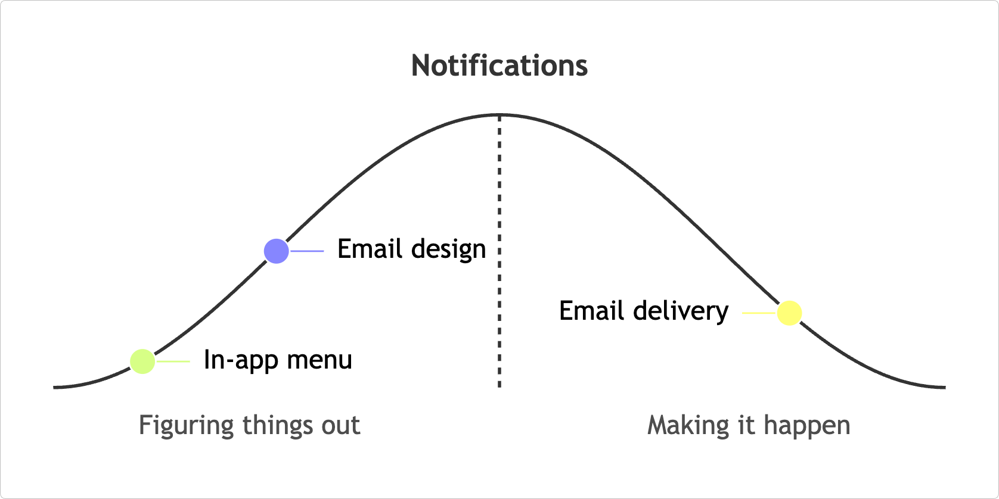

# Hill Charts for Mermaid

Publish Shape Up progress where you build, explain, and review the work.
In agent-driven workflows, agents report bet progress and momentum in the same text that tracks the work.



```
hillchart
  title Notifications
  scope "Email design": uphill 50
  scope "Email delivery": downhill 65
  scope "In-app menu": uphill 20
```

## Compatibility

- **Mermaid:** `^10.0.0 || ^11.0.0`
- **Host platform:** Must support external Mermaid diagrams. Native Markdown renderers on GitHub and GitLab usually do not load external plugins.

## Getting Started

```bash
npm install mermaid mermaid-hillchart
# or
pnpm add mermaid mermaid-hillchart
# or
yarn add mermaid mermaid-hillchart
```

```typescript
import mermaid from "mermaid"
import hillChart from "mermaid-hillchart"

await mermaid.registerExternalDiagrams([hillChart])
mermaid.initialize({
  startOnLoad: true,
  externalHillchart: {
    padding: 32,
  },
})
```

## Syntax

The `hillchart` syntax starts with the `hillchart` keyword followed by chart metadata, optional phase label overrides, and scopes. Single-line comments starting with `%%` are supported. The example below demonstrates the syntax features described in the reference that follows.

```
hillchart
  %% Notifications bet split into independent scopes
  title Notifications
  accTitle: Hill Chart for Notifications
  accDescr: Hill Chart showing four scopes. Template design is uphill near the top. Email delivery is downhill. In-app menu is early on the uphill side. SMS fallback is inactive at the start of the hill.

  uphill "Solving the approach"
  downhill "Execution"

  scope design "Template design": uphill 70
  scope delivery "Email delivery": downhill 65 #10b981
  scope menu "In-app menu": uphill 20
  scope sms "SMS fallback": uphill 0
```

### Language Features

- **Phase Labels:** Override the default left and right phase labels using `uphill <label>` and `downhill <label>`.
  - Defaults: `Figuring things out` and `Making it happen`, reflecting Shape Up’s uphill/downhill model from unknowns to execution.
- **Scopes:** Define scopes using `scope [id] "name": <phase> <position> [color]`.
  - `[id]` is optional. If provided, it is added as a modifier CSS class on the scope's SVG group (`hillchart-scope--id-<id>`), allowing for external CSS styling hooks.
  - `<phase>` can be `up`, `uphill`, `down`, or `downhill`.
  - `<position>` is a relative location on that side of the hill (commonly 0–100 for convenience), not a percentage of completion.
  - `[color]` is an optional hex color code (e.g., `#3b82f6`).
- **Accessibility:** Add `accTitle: <title>` and `accDescr: <description>` for screen readers.

## Theming

This plugin follows Mermaid's built-in theming system and `themeVariables`. By default, curve, label, and scope colors come from Mermaid theme variables, including the `cScale` palette used for automatic scope colors.

Use Mermaid `themeVariables` when you want Hill Charts to inherit from your site or app theme:

```javascript
mermaid.initialize({
  theme: "base",
  themeVariables: {
    primaryColor: "#334155",
    lineColor: "#94a3b8",
    cScale0: "#10b981",
    cScale1: "#3b82f6",
    cScale2: "#f59e0b",
  },
})
```

For diagram-specific overrides, the following CSS custom properties are exposed. You can override them in your site's stylesheet:

```css
:root {
  --mermaid-hillchart-curve-color: #94a3b8;
  --mermaid-hillchart-scope-color: #334155;
  /* Other available variables:
  --mermaid-hillchart-peak-color
  --mermaid-hillchart-title-color
  --mermaid-hillchart-phase-label-color
  --mermaid-hillchart-label-color
  --mermaid-hillchart-dot-stroke-color
  */
}
```

> [!NOTE]
> If you assign an `id` to a scope (e.g. `scope my_scope "Name": up 50`), the rendered SVG group will include the modifier class `hillchart-scope--id-my_scope`, allowing for targeted CSS overrides.
